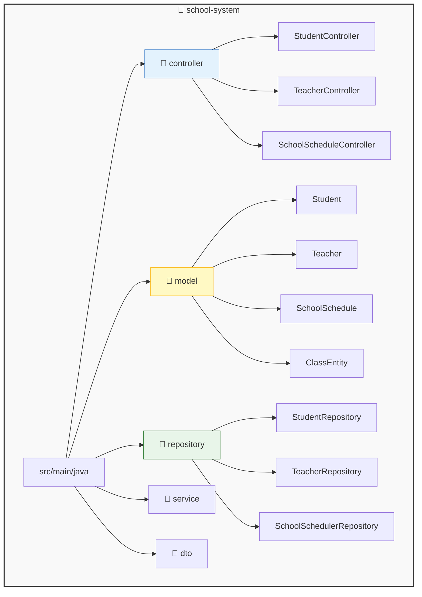
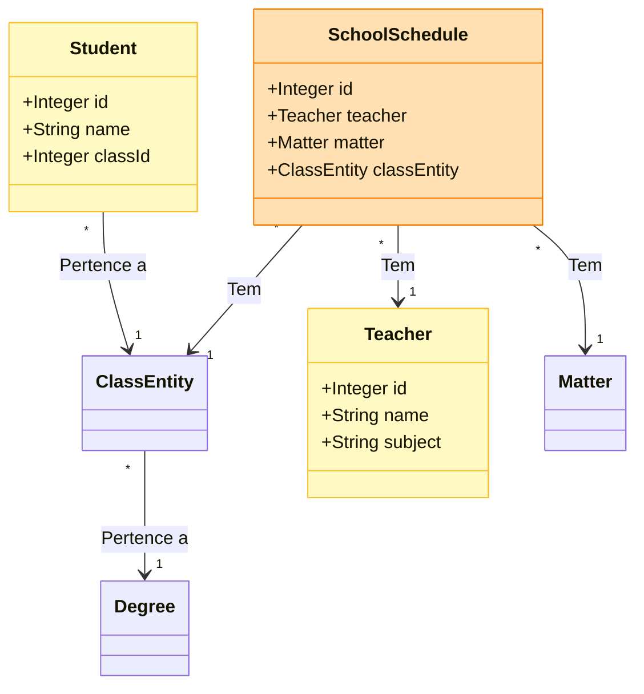

# 🏫 Sistema Escolar (School System API) - Teste Tecnico Estágio

> **ACESSE A APLICAÇÃO ONLINE (DEPLOY):**  
> 👉 [https://school-system-api-3au1.onrender.com](https://school-system-api-3au1.onrender.com)

Hospedei a aplicação na opção Free-Tier do Render, por isso, a aplicação demora 1-2 min para iniciar (Regras das plataforma de hospedagem)

Possivelmente ao iniciar, irá demorar 1 minuto para que os dados do banco sejam recebidos no Front End

---


## Visão Geral

O **School System** é um sistema de gerenciamento acadêmico focado em performance, integridade de dados e arquitetura limpa. Embora possua uma interface visual para demonstração, o coração do projeto é uma **API RESTful robusta** desenvolvida para resolver problemas complexos de alocação de turmas, gestão de grade horária, análise estatística tratamentos de possiveis erros.

O foco deste projeto é visa demonstrar boas práticas de engenharia de software no **Backend**, utilizando o ecossistema Java para garantir escalabilidade, manutenção e segurança.

---

## Por que Java e Spring Boot?

A escolha tecnológica foi estratégica, visando simular um ambiente corporativo de alto confiabilidade para usuários e clientes

1. **Robustez e Tipagem:** A tipagem estática do Java previne uma classe inteira de erros comuns em tempo de execução, garantindo que regras de negócio críticas não quebrem em produção.
2. **Ecossistema Enterprise:** O Spring Boot é o padrão global para microsserviços. Sua capacidade de autoconfiguração aliada à Injeção de Dependência (IoC) permite focar puramente na lógica de domínio.
3. **Escalabilidade e Performance:** A JVM moderna oferece gerenciamento de memória e Garbage Collection otimizados para lidar com alta concorrência e processamento de dados massivos.
4. **Dominio da Tecnologia:** E Tecnologia onde tenho mais experiência

---

## Stack Tecnológica

### Backend (Core)
- **Java 21 (LTS):** Linguagem base, escolhida pela estabilidade e suporte a novos recursos de linguagem.
- **Spring Boot 3:** Framework principal (Web, Data JPA, Validation).
- **Hibernate / JPA:** ORM para abstração de banco de dados e proteção nativa contra SQL Injection.
- **H2 Database:** Banco em memória para testes de integração e desenvolvimento local (`profile: dev`).
- **PostgreSQL:** Banco de dados relacional robusto para o ambiente de produção (`profile: prod`).
- **Maven:** Gerenciamento de dependências e build.

### Frontend (Client)
- **Vanilla JS + Bootstrap:** Consumidor leve da API, sem frameworks pesados, demonstrando domínio de fundamentos da Web (DOM, Fetch API, Async/Await) e desacoplamento total entre cliente e servidor.

---

## 📐 Arquitetura e Design

O projeto segue rigorosamente o padrão **MVC (Model-View-Controller)** com camadas de serviço e repositório bem definidas.

### Estrutura de Pacotes (Package Structure)



### Diagrama de Classes de Domínio

O diagrama abaixo ilustra os relacionamentos complexos ManyToOne (Muitos Para Um) gerenciados pelo JPA para vincular Professores, Matérias e Turmas na grade horária.



---

## Instalação e Execução

### Pré-requisitos
- Java 21+
- Maven (Opcional, wrapper incluso no projeto)
- Docker (Opcional, para containerização)

### Rodando Localmente

Clone o repositório:

```bash
git clone https://github.com/seu-usuario/school-system.git
cd school-system
```

Execute a aplicação (usando Maven Wrapper):

```bash
./mvnw spring-boot:run
```

Acesse:
- Aplicação Web: [http://localhost:8080](http://localhost:8080)
- Swagger UI: [http://localhost:8080/swagger-ui/index.html](http://localhost:8080/swagger-ui/index.html)
- Console H2: [http://localhost:8080/h2-console](http://localhost:8080/h2-console)

---

## Documentação dos Endpoints (API Reference)

A API segue os padrões REST. Abaixo estão os exemplos de corpo (body) JSON para as principais requisições.

### Alunos (/students)

- Criar Aluno  
  `POST /students/create`  
  Body:
  ```json
  {
    "name": "Roberto Silva",
    "classId": 5
  }
  ```

- Atualizar Aluno  
  `PUT /students/update/{id}`  
  Body:
  ```json
  {
    "name": "Roberto Silva Junior",
    "classId": 2
  }
  ```

- Deletar Aluno  
  `DELETE /students/delete/{id}`

- Resetar Base de Dados (Limpeza)  
  `DELETE /students/clear`

### Professores (/teachers)

- Criar Professor  
  `POST /teachers/create`  
  Body:
  ```json
  {
    "name": "Prof. Girafales",
    "subject": "Matemática Avançada"
  }
  ```

- Atualizar Professor  
  `PUT /teachers/update/{id}`  
  Body:
  ```json
  {
    "name": "Prof. Girafales",
    "subject": "Física"
  }
  ```

### Grade Horária (/schedule)

Este endpoint gerencia a alocação de aulas, exigindo o relacionamento entre três entidades.

- Criar Agendamento  
  `POST /schedule/create`  
  Nota: O payload deve conter os objetos aninhados com seus respectivos IDs.  
  Body:
  ```json
  {
    "teacher": { "id": 1 },
    "matter": { "id": 2 },
    "classEntity": { "id": 5 }
  }
  ```

- Deletar Agendamento  
  `DELETE /schedule/delete/{id}`
